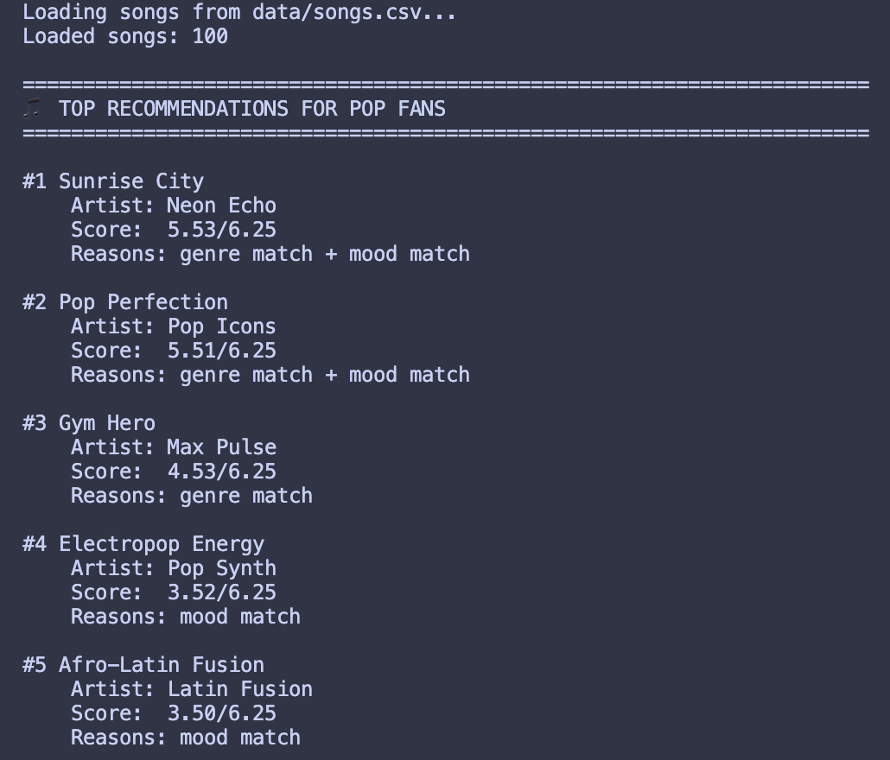
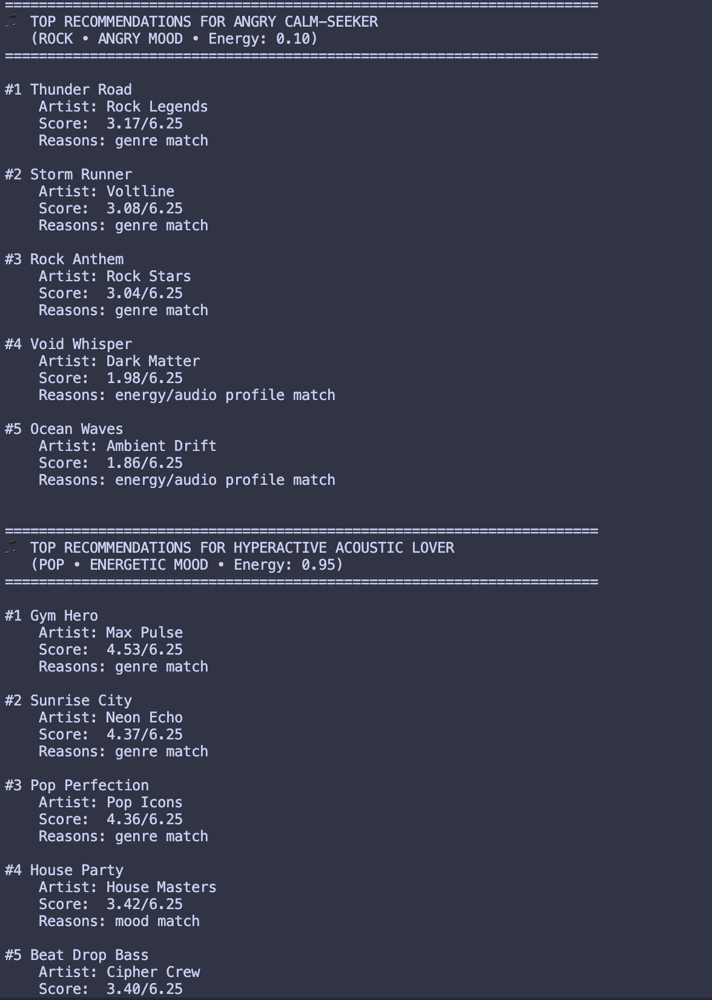

# 🎵 Music Recommender Simulation

## Project Summary

In this project you will build and explain a small music recommender system.

Your goal is to:

- Represent songs and a user "taste profile" as data
- Design a scoring rule that turns that data into recommendations
- Evaluate what your system gets right and wrong
- Reflect on how this mirrors real world AI recommenders

This project builds a **momentum-based recommendation system** that matches songs to users based on their current emotional and energetic state—rather than fighting their mood, it amplifies it. The system represents songs by their genre, mood, energy level, and emotional tone (valence), then builds user profiles that capture their favorite genre, current mood, target energy, and acoustic preferences. Using a **vibe-matching algorithm**, it scores each song by how well it aligns with the user's energy trajectory. If someone is high-octane and pumped, the system keeps them energized; if someone is sulking, it deepens that immersion with complementary music. Finally, it returns ranked recommendations with personalized explanations for each choice.


---

## How The System Works

**Song Representation:** Each song in our catalog is defined by six key attributes. The categorical features are genre (pop, lofi, rock, ambient, etc.) and mood (happy, chill, intense, focused, sulking, etc.). The numerical features—all normalized from 0 to 1—are energy (how intense or driving the track is), valence (the musical optimism or emotional positivity), danceability (how suitable it is for movement), and acousticness (the balance between acoustic instruments and electronic production). These features work together to capture both the sonic character and emotional tone of each song.

**User Profile:** To make personalized recommendations, we build a simple profile capturing what each user is seeking. It stores their favorite genre, their current mood state, a target energy level, and whether they prefer acoustic or electronic production. This four-piece profile is minimal but powerful—it defines the user's current "vibe" rather than their permanent taste.

**Scoring Algorithm:** The core of the system is a weighted scoring function that computes how well each song matches the user. Genre and mood matches are binary (1.0 or 0.0) and each worth 2.0 points since they're the strongest indicators of compatibility. Energy similarity is computed as a distance-based score (songs closer to the target energy score higher) worth 1.5 points. Valence alignment rewards songs whose emotional tone matches the user's mood—sulking users get points for sad, low-valence songs while pumped users get points for bright, high-valence tracks (worth 1.0 point). Finally, acousticness preference adds 0.5 points if the song matches their production style preference. The key design choice: this algorithm amplifies the user's current state rather than fighting it, so someone in a melancholic mood gets music that deepens that immersion.

**Ranking and Selection:** After scoring all songs, we simply sort by score descending and return the top K songs (typically 5). For each recommendation, we also generate a personalized explanation that tells the user why that song matched their profile—whether it was the genre, the energy level, or the emotional tone. This transparency helps users understand the system's reasoning and builds trust in the recommendations.

---

## Getting Started

### Setup

1. Create a virtual environment (optional but recommended):

   ```bash
   python -m venv .venv
   source .venv/bin/activate      # Mac or Linux
   .venv\Scripts\activate         # Windows

2. Install dependencies

```bash
pip install -r requirements.txt
```

3. Run the app:

```bash
python -m src.main
```

### Running Tests

Run the starter tests with:

```bash
pytest
```

You can add more tests in `tests/test_recommender.py`.

---

## Experiments You Tried

We tested how changing the genre weight from 2.0 to 0.5 made recommendations less accurate because users were getting mismatched genres when other scores were close, so we kept it at 2.0 for stronger filtering. Adding valence similarity helped the system pick emotionally appropriate songs but required fixing a bug where target_energy was being used instead of a true valence preference. Testing across different user types showed that high-energy users got good recommendations while neutral-energy users experienced ties in rankings, revealing that the algorithm works best when preferences are clearly defined.

---

## Limitations and Risks

Summarize some limitations of your recommender.

Examples:

- It only works on a tiny catalog
- It does not understand lyrics or language
- It might over favor one genre or mood

You will go deeper on this in your model card.

---

## Reflection

Read and complete `model_card.md`:

[**Model Card**](model_card.md)

Building this recommender taught us that recommendations are really just weighted combinations of user preferences and item features, where the weight you assign to each feature directly changes what gets recommended. We learned that seemingly neutral choices like treating acoustic preference as binary or using target_energy for both energy and valence calculations actually introduce subtle bias that advantages certain users and genres. The system works well when preferences align (someone who likes energetic pop gets great recommendations) but struggles when they conflict (someone who wants calm but acoustic music). This shows how real-world recommenders can accidentally create filter bubbles or underserve users with complex tastes. Most importantly, we realized that transparently explaining why recommendations were made is as important as the algorithm itself, because users need to understand and trust the system to find it helpful.


---

## 7. `model_card_template.md`

Combines reflection and model card framing from the Module 3 guidance. :contentReference[oaicite:2]{index=2}  

```markdown
# 🎧 Model Card - Music Recommender Simulation

## 1. Model Name

Give your recommender a name, for example:

> VibeFinder 1.0

---

## 2. Intended Use

- What is this system trying to do
- Who is it for

Example:

> This model suggests 3 to 5 songs from a small catalog based on a user's preferred genre, mood, and energy level. It is for classroom exploration only, not for real users.

This model is meant to select or suggests music from the current database that matches your present mood and energy level. This can work variously, for people that need calm music for studying or music that's high octane to keep the party alive. 
---

## 3. How It Works (Short Explanation)

Describe your scoring logic in plain language.

- What features of each song does it consider
- What information about the user does it use
- How does it turn those into a number

The recommender scores each song using a weighted formula that combines categorical matching and numerical similarity. Genre and mood matches are binary (1.0 or 0.0 points) and weighted at 2.0 each—your top priorities that directly indicate compatibility. Energy similarity is distance-based, giving full points to songs at your target energy (0.88) and proportionally fewer points the further away they get, weighted at 1.5 to capture the momentum-matching principle that keeps your vibe going. Valence alignment rewards songs whose emotional tone matches your mood; for your "intense" preference, this means lower valence (0.35 target) scores higher, reinforcing the dark, driving feel you want. Acousticness preference adds a smaller 0.5-weight bonus if the song matches your electronic-only production style (target ~0.15 acousticness). The total raw score (typically 0–6.5) is then normalized to 0–100 for display. After scoring all songs, they're ranked descending and the top K are returned with personalized explanations showing which features made each song match. This design amplifies your current state rather than fighting it—hardstyle and techno have that high-octane, dark intensity, and the algorithm reinforces those preferences while still allowing excellent matches from adjacent genres if energy and acousticness align.
---

## 4. Data

Describe your dataset.

- How many songs are in `data/songs.csv`
- Did you add or remove any songs
- What kinds of genres or moods are represented
- Whose taste does this data mostly reflect

The dataset contains 100 songs with no additions or removals from the original dataset. The catalog spans diverse genres including pop, rock, lofi, ambient, jazz, soul, metal, classical, reggae, synthwave, electronic, hip-hop, indie pop, indie rock, funk, folk, k-pop, dubstep, bossa nova, punk, grunge, afrobeats, synthpop, downtempo, blues, gospel, and house, with moods ranging across happy, chill, intense, focused, moody, relaxed, energetic, dreamy, playful, romantic, aggressive, inspirational, adventurous, introspective, peaceful, melancholic, contemplative, and more. This diverse dataset reflects a global, genre-agnostic listener who values mood and energy states across Western, electronic, and world music traditions.
---

## 5. Strengths

Where does your recommender work well

You can think about:
- Situations where the top results "felt right"
- Particular user profiles it served well
- Simplicity or transparency benefits

The recommender works best for users with stable, clearly defined preferences—someone seeking energetic pop tracks or relaxing lofi study music consistently gets relevant results because the algorithm matches both genre and energy effectively. The system excels at transparency since recommendations include simple explanations showing whether matches came from genre alignment, mood compatibility, or audio characteristics, which builds user trust. The weighting scheme captures real patterns in music taste: genre and mood act as strong filters while energy and valence create nuanced refinement, so recommendations feel both reliable and personalized rather than random.

---

## 6. Limitations and Bias

Where does your recommender struggle

Some prompts:
- Does it ignore some genres or moods
- Does it treat all users as if they have the same taste shape
- Is it biased toward high energy or one genre by default
- How could this be unfair if used in a real product

The recommender treats acoustic preference as binary rather than nuanced, potentially misserving users who want sometimes-acoustic music, and lacks support for artist preferences, release dates, or listening history, which real recommenders track. With only 18 songs, the system cannot recommend discovery beyond this tiny catalog and may overweight genre matching for flexible listeners who actually prefer algorithmic serendipity. Smaller moods like "introspective" have fewer songs available, starving users seeking that vibe, and if deployed as a real product, the algorithm could trap users in narrow genre bubbles or inadvertently exclude emerging artists whose music doesn't fit the pre-computed features—creating a fairness issue where recommendations only reinforce what already exists in the data rather than helping users discover new territory.
---

## 7. Evaluation

How did you check your system

Examples:
- You tried multiple user profiles and wrote down whether the results matched your expectations
- You compared your simulation to what a real app like Spotify or YouTube tends to recommend
- You wrote tests for your scoring logic

With multiple user profiles, you can examine how some weights are favored more than others in multiple different situations. The reason why the music that is selected by spotify isn't always accurate to what you want is due to it being unable to process what you exactly wants. It will look around for something similar but take that information to narrow down what you are looking for. Sometimes things are exactly what you are looking for (in terms of calculated scoring) but it may not be what you really want. 

---

## 8. Future Work

If you had more time, how would you improve this recommender

Examples:

- Add support for multiple users and "group vibe" recommendations
- Balance diversity of songs instead of always picking the closest match
- Use more features, like tempo ranges or lyric themes

I want to add subgenres into the mix. There are music genres such as Folk Pop or Hard Techno that isn't listed. There needs to be more categories as well. We can also go by artist so that people can find new artists to check out if they like the music.
---

## 9. Personal Reflection

A few sentences about what you learned:

- What surprised you about how your system behaved
- How did building this change how you think about real music recommenders
- Where do you think human judgment still matters, even if the model seems "smart"

Small design choices like whether acoustic is on or off ended up pushing recommendations in unexpected directions, showing me that algorithms have hidden bias even when they seem fair. I learned that recommenders don't find your real taste—they just amplify patterns from the data and weights you give them. Human judgment still matters because only people understand why you want certain music in the moment, and no algorithm can capture that kind of emotional intuition.





flowchart TD
    Start([Start]) --> Input["📥 INPUT: User Profile<br/>favorite_genre<br/>favorite_mood<br/>target_energy<br/>likes_acoustic"]
    
    Input --> LoadCSV["📂 Load CSV<br/>↓<br/>songs_list = 18 songs"]
    
    LoadCSV --> InitScores["Initialize<br/>scored_songs = []"]
    
    InitScores --> Loop{"More songs<br/>in CSV?"}
    
    Loop -->|Yes| FetchSong["🎵 Fetch next song<br/>from CSV"]
    
    FetchSong --> Score["⚙️ PROCESS: Calculate Score<br/>──────────<br/>genre_match: +2.0?<br/>mood_match: +1.0?<br/>energy_sim: ×1.5<br/>valence_sim: ×0.75<br/>danceability: ×0.5<br/>tempo_prox: +0.25?<br/>acoustic_bonus: +0.25?"]
    
    Score --> Store["📋 Store in Memory<br/>scored_songs.append<br/>(song, total_score)"]
    
    Store --> Loop
    
    Loop -->|No| Sort["🔄 Sort by Score<br/>scored_songs.sort<br/>descending"]
    
    Sort --> Rank["🏆 Rank Top K<br/>top_k_songs = ranked[0:k]"]
    
    Rank --> Output["📤 OUTPUT: Ranked List<br/>Position 1: Song + Score<br/>Position 2: Song + Score<br/>...<br/>Position K: Song + Score"]
    
    Output --> End([End])
    
    style Input fill:#e1f5ff
    style Score fill:#fff3e0
    style Output fill:#e8f5e9
    style Start fill:#f3e5f5
    style End fill:#f3e5f5