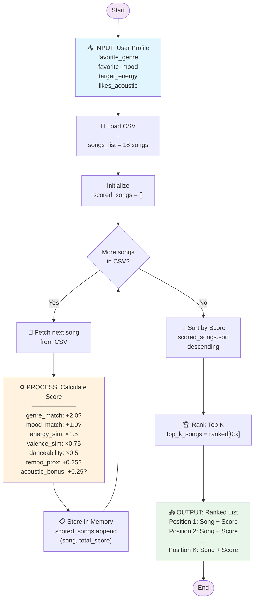

# Music Recommendation Data Flow

## Process Overview

## Scoring Recipe

| Component | Points |
|-----------|--------|
| Genre match | +2.0 |
| Mood match | +1.0 |
| Energy similarity | ×1.5 |
| Valence similarity | ×0.75 |
| Danceability | ×0.5 |
| Tempo proximity | +0.25 |
| Acoustic bonus | +0.25 |
| **Max Score** | **~6.25** |

## Flow Summary

1. **INPUT**: Load user preferences and CSV songs
2. **PROCESS**: Loop through each song, calculate score using weighting formula
3. **OUTPUT**: Sort all scored songs and return top K recommendations
